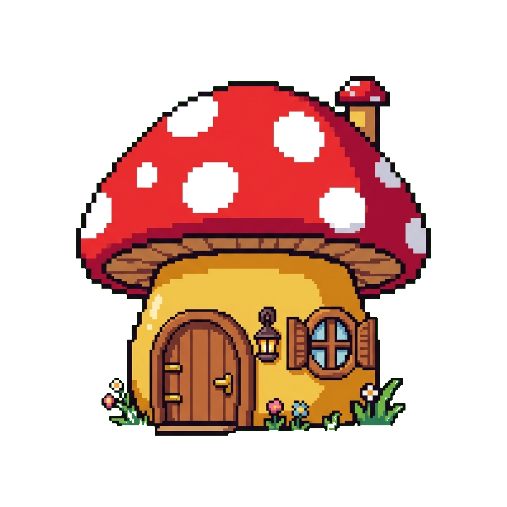
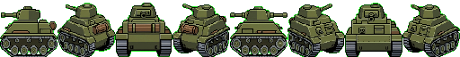

# 2D Asset Pipeline

A pixel art asset creation pipeline. Trigger it with a text description to generate game-ready sprites and animated GIFs — fully transparent background, exact pixel dimensions, and no manual cleanup.

Two workflows:

- **Single asset** — describe a sprite and get a sized, transparent PNG ready to drop into a game project
- **Animation frames** — describe a sprite and an animation, get a looping GIF with frame-accurate timing

Both workflows save directly to `~/game_assets` by default.

---



---

## Setup

### 1. Download Friday

1. Go to [hellofriday.ai](https://hellofriday.ai) and download the macOS installer
2. Open the DMG and drag Friday to your Applications folder
3. Launch Friday and complete the initial setup

### 2. Import the workspace

1. Open Friday and go to **Discover Spaces**
2. Find this workspace and click it
3. Click **Add Space**

### 3. Install dependencies

The pipeline uses ImageMagick to convert and resize images and Pillow for spritesheet processing. Both must be available in your `PATH`.

**ImageMagick**

```bash
brew install imagemagick
```

**Pillow** (installed automatically by the Friday SDK Python environment — no manual action needed)

### 4. That's it

No API keys, no external services, no email address to configure. The workspace runs entirely locally.

---

## How to use it

Both workflows are triggered on-demand via HTTP signal.

### Generate a single asset

Trigger the `/create-pixel-asset` endpoint with a description, and optionally a size and style:

| Parameter | Required | Description | Example |
|---|---|---|---|
| `description` | Yes | What to generate | `"a medieval sword"` |
| `size` | No | Canvas size in pixels (default: `64x64`) | `"32x32"` |
| `style` | No | Art style notes | `"dark fantasy"`, `"cute chibi"` |

**Example — in the Friday chat:**

> Trigger create-pixel-asset: description "a wooden shield", size "64x64", style "SNES palette"

The pipeline generates the PNG, saves it to `~/game_assets/asset_<timestamp>.png`, removes the green-screen background, and resizes to the exact requested dimensions.

### Generate animation frames

Trigger the `/create-animation-frames` endpoint with a description and animation type:

| Parameter | Required | Description | Example |
|---|---|---|---|
| `description` | Yes | The sprite to animate | `"a walking knight"` |
| `animation` | Yes | What motion to create | `"walk cycle"`, `"idle breathing"` |
| `frame_count` | No | Number of frames (default: `4`) | `"8"` |
| `size` | No | Dimensions per frame (default: `64x64`) | `"32x32"` |
| `frame_delay_ms` | No | Milliseconds per frame (default: `150`) | `"100"` |

**Example — in the Friday chat:**

> Trigger create-animation-frames: description "a flickering torch", animation "flame flicker", frame_count "6", size "32x32"

The pipeline generates a raw spritesheet, normalizes it to exact frame dimensions, assembles it into a looping GIF, and saves to `~/game_assets/`.

---

## How it works

### Single asset pipeline


| Component | Role |
|---|---|
| `create-pixel-asset` signal | HTTP trigger at `/create-pixel-asset` accepting description, size, style |
| `create-pixel-asset-job` | Five-state FSM: idle → generate → save → remove background → resize → done |
| `pixel-asset-generator` | Atlas image-generation agent; produces a neon-green-background PNG at requested canvas size |
| `file-saver` | Python user agent; fetches the artifact from the Friday API and writes it to disk |
| `background-remover` | LLM agent (Claude Haiku); runs two-pass ImageMagick chroma key to remove neon green and make the sprite transparent |
| `image-resizer` | LLM agent (Claude Haiku); runs ImageMagick nearest-neighbour resize to exact target dimensions |

### Animation pipeline



| Component | Role |
|---|---|
| `create-animation-frames` signal | HTTP trigger at `/create-animation-frames` |
| `create-animation-frames-job` | Eight-state FSM with a retry loop: idle → generate spritesheet → save → normalize → check → route → assemble GIF → resize → done |
| `animation-frame-generator` | Atlas image-generation agent; produces a horizontal spritesheet with all frames side by side |
| `file-saver` | Python user agent; saves the raw spritesheet PNG to disk |
| `spritesheet-normalizer` | Python user agent; detects background color from corners, slices frames to exact dimensions using NEAREST resampling, and returns `regenerate: true` if the canvas is malformed |
| `check-normalize-result` | Inline LLM step (Claude Haiku); reads normalizer output and emits `REGENERATE` or `OK` |
| `route-after-normalize` | Inline LLM step (Claude Haiku); routes the FSM to retry generation or proceed to assembly |
| `gif-assembler` | LLM agent (Claude Opus); runs a Python/Pillow script to slice frames and produce the final looping GIF |
| `image-resizer` | LLM agent (Claude Haiku); final nearest-neighbour resize |
| `filesystem` MCP server | Provides the `bash` tool used by gif-assembler, image-resizer, and background-remover |

The animation job includes a regeneration loop: if the spritesheet normalizer cannot parse frame boundaries (canvas dimensions wrong and no clean column separators detected), it sets `regenerate: true` and the FSM routes back to `generate-frames` to try again.

---

## Notes

- Output files land in `~/game_assets/` by default. To change this, pass `output_dir` in the signal payload, or edit the default in the job prompts.
- The background-removal pipeline uses neon green (`#00FF00`) as a chroma key color. The image generation agents are instructed never to use neon green on the sprite itself — if you see transparency artifacts on legitimate sprite pixels, the generation step picked a palette that overlaps with the key color. Re-trigger to regenerate.
- The spritesheet normalizer runs in the Friday SDK Python environment and does not require any extra installation — Pillow is available there.
- ImageMagick must be installed system-wide (`brew install imagemagick`). The pipeline does not install it automatically.
- The `filesystem` MCP server is granted access to `${HOME}` — this is the broadest safe scope needed for writing to `~/game_assets`. You can tighten it to a specific directory by editing the `args` in `workspace.yml` under `tools.mcp.servers.filesystem`.
- All generation happens locally — no image data is sent to external services beyond the Anthropic API call that drives the image-generation agents.
