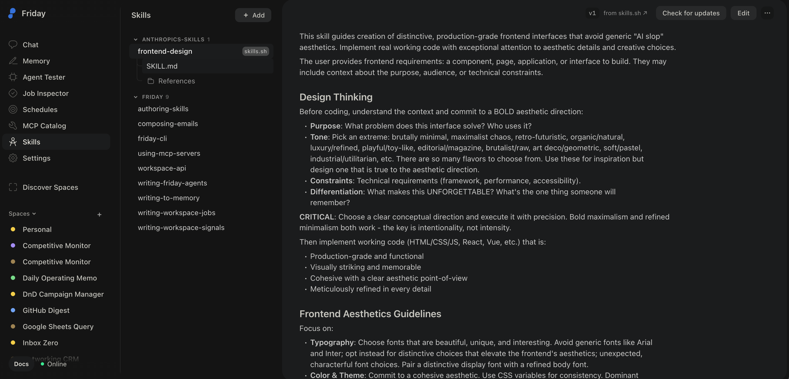

# Competitive Monitor

A weekly competitor intelligence workspace. Every Monday at 8:00am Pacific, it searches the web for recent product moves, pricing changes, and GTM signals from your tracked competitors, clusters findings by theme, and delivers a sourced brief with verified dates.

It covers five categories across the prior 7 days:

- **Product** — new features, launches, deprecations
- **Pricing** — plan changes, discounts, packaging shifts
- **GTM** — campaigns, positioning changes, new messaging
- **Partnerships** — integrations, co-marketing, ecosystem moves
- **Leadership** — executive hires, departures, org changes

Every finding includes what happened, an exact confirmed date, and a direct link to the source article. Findings without a verified date and article URL are dropped — no fabricated dates, no homepage links.

---

## Setup

### 1. Download Friday

1. Go to [hellofriday.ai](https://hellofriday.ai) and download the macOS installer
2. Open the DMG and drag Friday to your Applications folder
3. Launch Friday and complete the initial setup

### 2. Import the workspace

1. Open Friday and go to **Discover Spaces**
2. Find this workspace and click it
3. Click **Add Space**

### 3. Update your competitor list

The default scan targets **Google** and **Facebook**. To change this:

1. Go to **Jobs → Competitive Monitor Weekly Scan**
2. In the `research` state agent prompt, update the competitors line:
   `Run a competitive intelligence scan ... on these competitors: Google, Facebook.`
3. Replace with your actual competitors

You can also override competitors on a per-run basis using the `run-now` signal's `competitors` input field without changing the job config.

---

## What the brief looks like

Findings are clustered by theme and delivered as a structured report artifact in the workspace. Each entry follows this format:

> **What happened**
> Announced: April 21, 2025
> Source: [Publication Name](https://specific-article-url)

---

## How to use it

It runs automatically. Nothing to trigger, nothing to open.

If you want to fire it outside the Monday schedule — say, mid-week after a competitor announcement — trigger the `run-now` signal from the workspace. You can optionally pass:

- `competitors` — override the default list (Google, Facebook) with specific names
- `focus_areas` — limit the scan to specific themes: `pricing`, `product`, `packaging`, `gtm`, `partnerships`, `leadership`
- `lookback_days` — how many days back to search (default: 7, max: 90)

---

## How it works

| Component | Role |
|---|---|
| `competitive-analyst` agent | Atlas web agent that searches the web, visits source pages to verify dates and URLs, and produces a clustered intelligence brief |
| `competitive-scan` job | Three-state FSM: idle → research → done |
| `run-now` signal | HTTP signal — trigger on demand with optional `competitors`, `focus_areas`, and `lookback_days` inputs |
| `weekly-scan` signal | Schedule signal firing at `0 8 * * 1` (8:00am Pacific, Mondays only) |

Either signal starts the `competitive-scan` FSM. The FSM transitions from `idle` to `research`, runs the `competitive-analyst` agent, emits an `ADVANCE` event, and moves to `done`. The output is stored as a `scan-report` artifact in the session.

---

## Notes

- The scan defaults to a 7-day lookback window. Pass `lookback_days` via `run-now` to go further back (up to 90 days).
- The analyst is instructed to drop any finding it cannot confirm with a real article URL and verified publication date — you will not see fabricated or undated entries.
- Competitors are currently hardcoded in the job prompt as **Google** and **Facebook**. Update the job config or use the `run-now` signal's `competitors` field to scan others.
- The scan runs for up to 15 minutes. Large competitor lists or long lookback windows may approach this limit.
- All data stays within your Friday workspace and the public web. No external services beyond the LLM call and web search.
