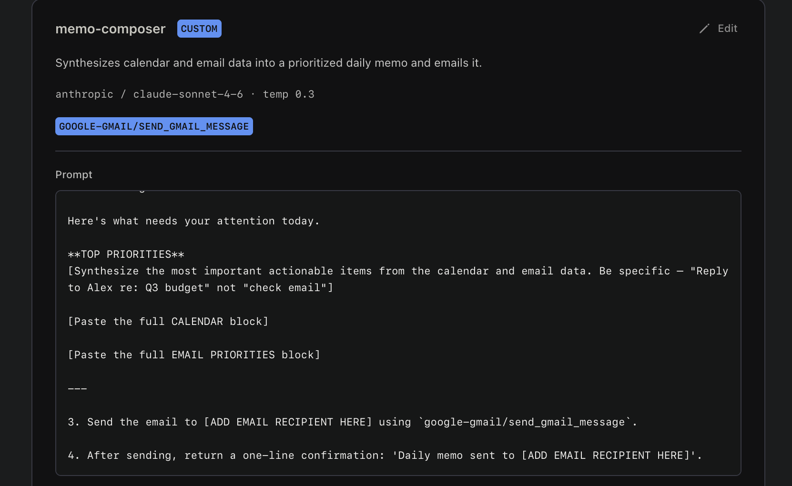
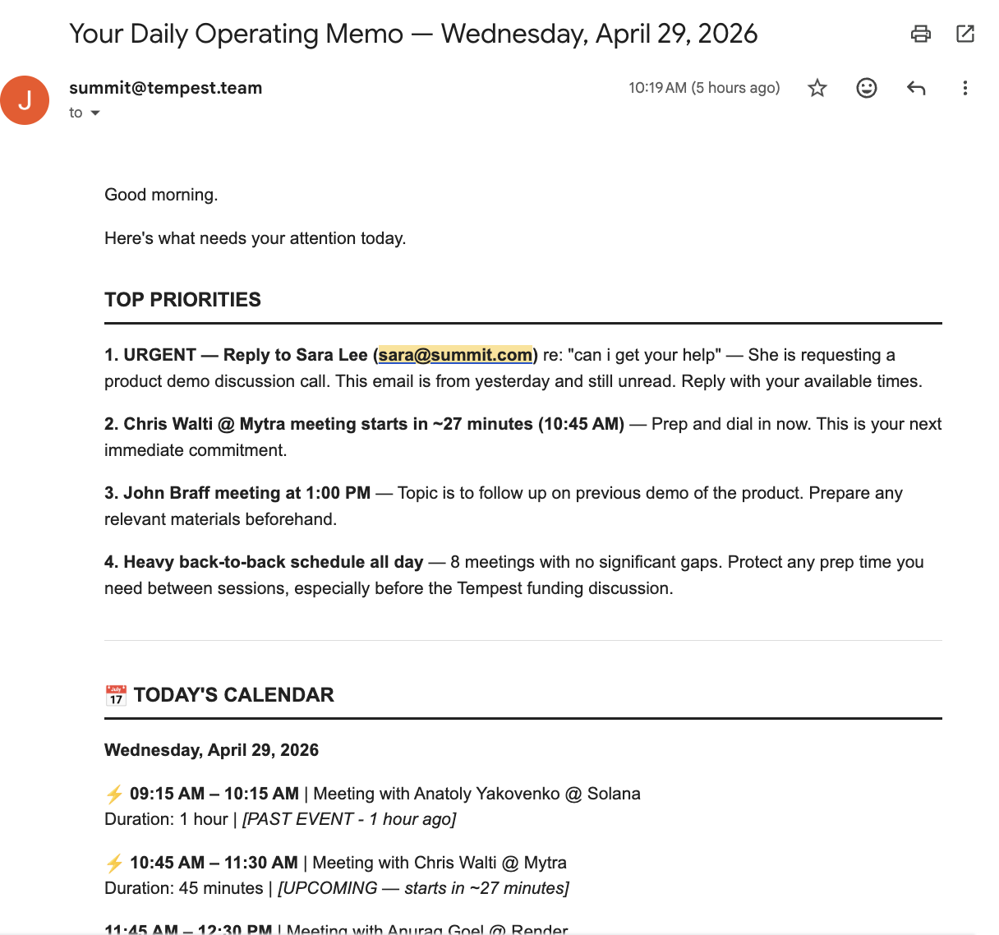
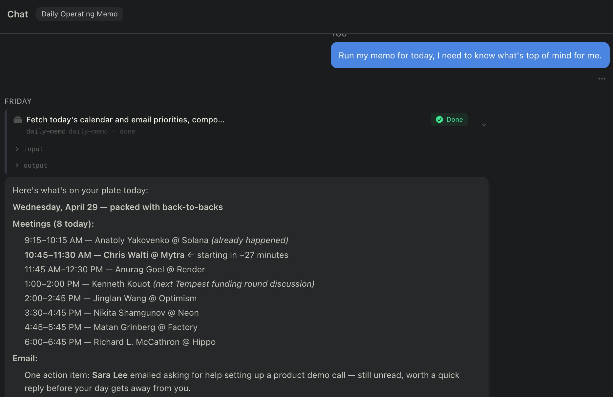

# Daily Operating Memo

A morning briefing workspace. Every weekday at 7:30am Pacific, it pulls your Google Calendar and Gmail, synthesizes what actually needs your attention, and sends a prioritized memo to your inbox.

It checks two sources every morning:

- **Google Calendar** — all events for the full day, sorted chronologically, with ⚡ flags on anything starting within the next 2 hours
- **Gmail** — recent unread and important emails, triaged into what needs a reply today (🔴), what's worth knowing (🟡), and any deadlines or time-sensitive threads (⏰)

The memo-composer synthesizes those two blocks into a single email with a **Top Priorities** section at the top — specific actions, not vague reminders — and sends it to your inbox.

---

## Setup

### 1. Download Friday

1. Go to [hellofriday.ai](https://hellofriday.ai) and download the macOS installer
2. Open the DMG and drag Friday to your Applications folder
3. Launch Friday and complete the initial setup

### 2. Import the workspace

1. Open Friday and go to **Discover Spaces**
2. Find this workspace and click it
3. Click **Add Space**

### 3. Connect Google Calendar and Gmail

1. Go to **MCP Catalog**
2. Go to **Gmail**
3. Under **Credentials**, click **Add one**
4. Connect your account (the memo is sent from and to this account)
5. Repeat this for **Google Calendar**

### 4. Set your recipient email

1. Go to **Agents > memo-composer**
2. In the agent prompt, find: `[ADD EMAIL RECIPIENT HERE]` (appears twice)
3. Replace both instances with your email address

Once both steps are done, the schedule will fire automatically on the next weekday at 7:30am Pacific.

---

## What the memo looks like

> **Subject: Your Daily Operating Memo — Monday, April 28**
>
> Good morning.
>
> Here's what needs your attention today.
>
> **TOP PRIORITIES**
> — Reply to Alex re: Q3 budget (🔴 email, flagged important)
> — Prep for 10am product sync (⚡ in 45 min)
>
> **📅 TODAY'S CALENDAR**
> ...
>
> **📬 EMAIL PRIORITIES**
> ...

---

## How to use it

It runs automatically. Nothing to trigger, nothing to open.

If you want to fire it outside the schedule — say, mid-afternoon for a second look — trigger the `run-daily-memo` signal from the workspace.

---

## How it works

| Component | Role |
|---|---|
| `calendar-fetcher` agent | LLM agent (Claude Haiku) that fetches today's full calendar window in local timezone |
| `gmail-fetcher` agent | LLM agent (Claude Haiku) that scans for unread and important emails from the last 1–2 days |
| `memo-composer` agent | LLM agent (Claude Sonnet) that synthesizes both blocks and sends the final email |
| `daily-memo` job | Three-state FSM: fetch calendar → fetch email → compose and send |
| `run-daily-memo` signal | Schedule signal firing at `30 7 * * 1-5` (7:30am Pacific, weekdays only) |
| `google-calendar` MCP server | Provides `list_calendars` and `get_events` tools |
| `google-gmail` MCP server | Provides `search_gmail_messages`, `get_gmail_messages_content_batch`, and `send_gmail_message` tools |

The schedule fires the `run-daily-memo` signal, which starts the `daily-memo` FSM. The FSM runs the three agents in sequence: calendar first, then email, then the composer which sends the final memo and returns a one-line confirmation.

---

## Notes

- The calendar fetch uses your local timezone (America/Los_Angeles) for the full-day window — not UTC, so early-morning events aren't missed.
- To change the recipient, update the `memo-composer` agent prompt (find and replace both instances of your email address).
- All data stays within your Friday workspace and Google OAuth session. Nothing is routed through external services beyond the LLM call and Google's own APIs.
- The composer will not fabricate priorities. If your calendar is empty and inbox is clear, it says so.
