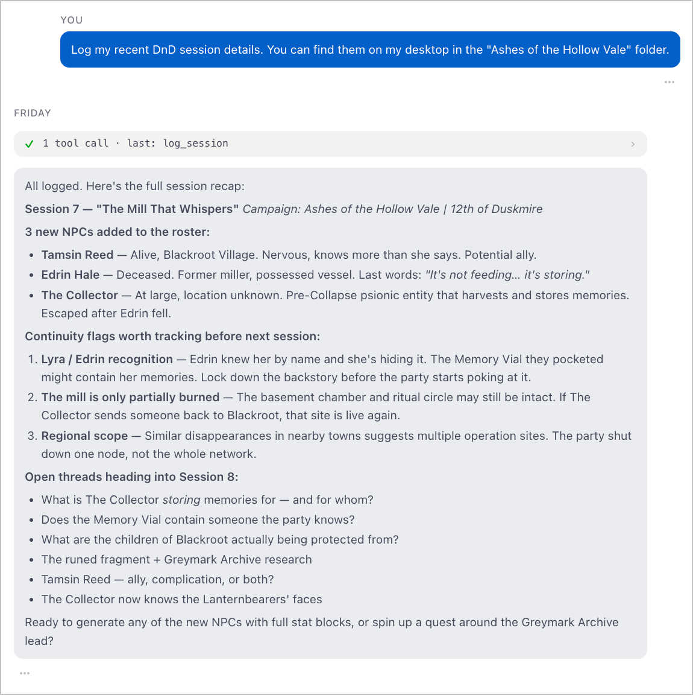
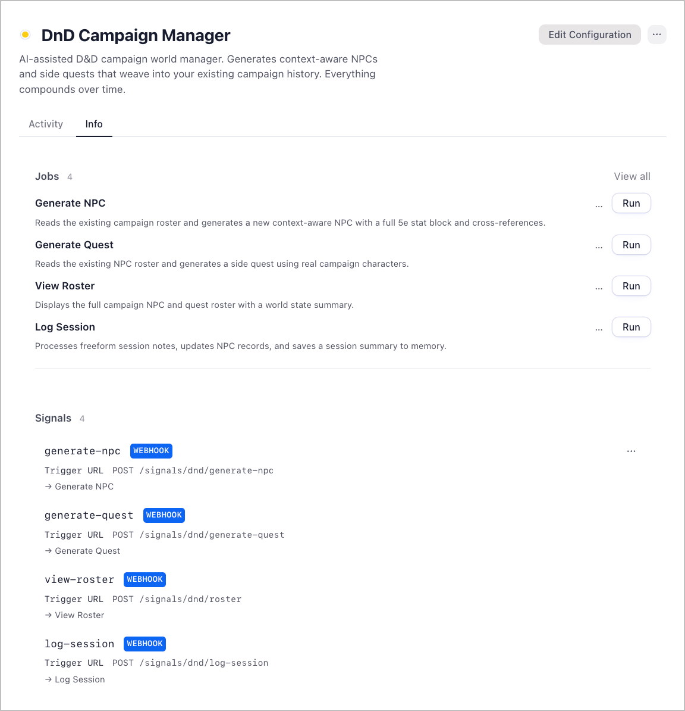

# DnD Campaign Manager

An AI-assisted D&D campaign world manager. Generate context-aware NPCs, spin up side quests, and log session notes — everything builds on what came before, so your world compounds over time.

There's no spreadsheet to maintain, no wiki to update after every session. Just describe what you need:

- **Generate an NPC** — "I need a corrupt harbormaster who's been quietly skimming from Ledger shipments" — and get a full 5e stat block with cross-references to existing characters
- **Generate a side quest** — "Something that draws the party toward the south quarter warehouse" — woven from NPCs already in the roster
- **Log a session** — Dump raw notes after the game, and the system updates NPC records, tracks continuity, and saves a clean summary
- **View the roster** — Get a world state snapshot: who's alive, who's in custody, what threads are open

Every generation reads the current campaign state first. NPCs know about each other. Quests use characters who already exist. The world stays consistent.

---

---

## Setup

### 1. Download Friday

1. Go to [hellofriday.ai](https://hellofriday.ai) and download the macOS installer
2. Open the DMG and drag Friday to your Applications folder
3. Launch Friday and complete the initial setup

### 2. Import the workspace

1. Open Friday and go to **Discover Spaces**
2. Find this workspace and click it
3. Click **Add Space**

Start a chat and share your session notes to seed your campaign history, or jump straight to **Generate NPC** and **Generate Quest** to start populating the world.

---

## How to use it

Use the jobs directly from the Friday UI, or trigger them via their HTTP signals.

**Generate an NPC:**
> "A mid-level Crimson Ledger enforcer who suspects Sable is about to cut him loose"

**Generate a quest:**
> "Something that finally pays off the south quarter warehouse thread — morally uncomfortable, no clean resolution"

**Log a session:**
> Paste your raw notes — who showed up, what was invented on the fly, what the party did — and the system handles the rest

**View the roster:**
> Run it with no prompt for a full world state summary, or ask about a specific character or thread

---

## How it works

| Component | Role |
|---|---|
| `npc-generator` agent | Reads roster memory, generates a new NPC with full 5e stat block and campaign cross-references |
| `quest-generator` agent | Reads NPC roster, generates a side quest using real campaign characters |
| `roster-viewer` agent | Produces a world state summary — NPCs, quests, open threads |
| `session-logger` agent | Processes freeform session notes, updates NPC records, saves a structured summary |
| `notes` memory | Short-term narrative memory — session logs, NPC updates, continuity flags |
| `memory` memory | Long-term memory distilled by the system workspace over time |

Each job reads the current memory state before generating anything. The roster viewer aggregates everything into a single snapshot. Session logs write back to memory so the next generation is always working from the latest world state.

---

## Current campaign: The Ashford Campaign

A city-corruption arc set in Ashford, a port city where real power flows through the docks. Eight sessions in. The Crimson Ledger crime organization has been partially dismantled — one sergeant in custody, one dockmaster at large, one Merchant's Council patron identified but untouchable. Something older called the Pale Compact may be pulling strings above all of them.

**Active NPCs include:** Varek Dunnmore, Sera Voss, Harlen Croft, Orvyn Sable, Mira Ashvane, Tommy Ashcart, Renn, Brix, Councillor Aldren Voss, and one horse named Biscuit who is technically evidence.

---

## Notes

- All campaign data stays in your Friday workspace memory — nothing is stored externally beyond the LLM call.
- The generators will not invent contradictions. If a character is in custody, they're in custody. If a thread is unresolved, it stays unresolved until you log otherwise.
- Long-term memory is distilled automatically over time by the system workspace — you don't need to manage continuity manually.
- Continuity flags (like NPC name conflicts) are surfaced in session logs rather than silently resolved. The DM decides.
