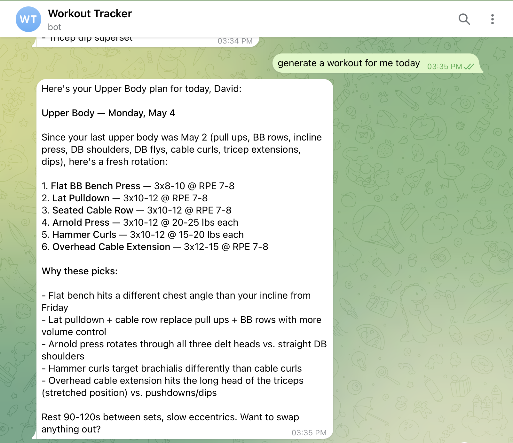
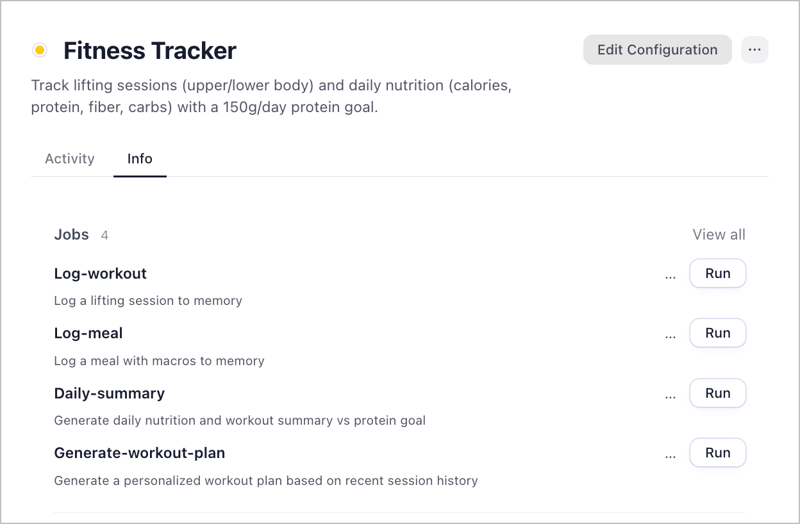

# Fitness Tracker

A lifting and nutrition tracking workspace. Log workouts and meals through chat, track daily protein against a 150g goal, and get personalized workout plans that build on your recent session history.

No app to open, no form to fill. Just tell it what you did:
- "Just did upper body — bench 3x8 185, OHP 3x10 115"
- "Had chicken and rice, about 500 cal, 45g protein"
- "What's my summary for today?"
- "Give me a workout plan for tomorrow"

---

---

## Setup

### 1. Download Friday
1. Go to [hellofriday.ai](https://hellofriday.ai) and download the macOS installer
2. Open the DMG and drag Friday to your Applications folder
3. Launch Friday and complete the initial setup

### 2. Import the workspace
1. Open Friday and go to **Discover Spaces**
2. Find this workspace and click it
3. Click **Add Space**

### 3. Connect the Telegram communicator
1. Go to your space > **Overview > Info > Communicators**
2. Find the Telegram communicator and connect it

Once connected, messages sent to the linked Telegram bot will trigger the workspace automatically.

---

## How to use it

Talk to the workspace in chat. Four things you can do:

**Log a workout** — describe your session and it's saved to memory:
> "Upper body today — bench 3x8 185lb, OHP 3x10 115lb, cable rows 3x12 120lb"

**Log a meal** — name the meal and rough macros:
> "Lunch was a chicken burrito bowl, ~750 cal, 52g protein, 80g carbs, 8g fiber"

**Daily summary** — get a snapshot of today's nutrition and workouts vs your 150g protein goal:
> "What's today's summary?"

**Workout plan** — get a personalized plan based on your recent session history:
> "Plan my next workout — no barbell today"

---

## How it works

| Component | Role |
|---|---|
| `log-workout-agent` | Parses workout descriptions and writes session records to memory |
| `log-meal-agent` | Parses meal descriptions with calories, protein, carbs, and fiber, then writes to memory |
| `daily-summary-agent` | Reads today's logs and generates a nutrition and workout summary vs the 150g protein goal |
| `workout-planner-agent` | Reads recent session history and generates a personalized next-session plan |

### Signals

| Signal | Trigger |
|---|---|
| `log-workout` | Manual — describe a lifting session |
| `log-meal` | Manual — describe a meal with macros |
| `daily-summary` | Manual — request today's summary |
| `generate-workout-plan` | Manual — request a new workout plan |

### Memory stores

| Store | Purpose |
|---|---|
| `notes` (short-term, narrative) | Rolling log of workouts and meals within the current period |
| `memory` (long-term, narrative) | Longer-term history distilled over time |

---

## Notes

- Protein goal is 150g/day — hardcoded in the `daily-summary-agent` prompt. Change it there to adjust.
- Workout history is read by the planner to alternate upper/lower days and avoid repeating the same movements back-to-back.
- The planner respects preferences passed at run time: "short session," "focus on hypertrophy," "no barbell."
- All data stays in your Friday workspace memory — nothing is sent externally beyond the LLM call.
- Long-term memory is distilled automatically over time — no manual continuity management needed.
