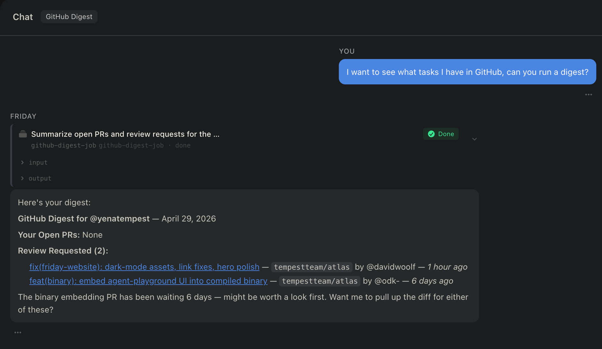

# GitHub Digest

A scheduled pull request briefing that runs in your Friday workspace. Every Monday and Thursday at 8:30am Pacific, it scans GitHub for your open PRs and pending review requests, synthesizes a clean digest, and surfaces it — no dashboard to open, no GitHub inbox to scan.

---

## What it does

GitHub Digest gives you a focused view of your PR workload twice a week. It checks one source on each run:

- **GitHub** — your open pull requests (authored by you, across all repos) and any PRs where you've been requested as a reviewer

The digest is organized into three sections:

- **Your Open PRs** — title, repo, URL, age, and current review status (approved / changes requested / awaiting)
- **Review Requested** — PRs where you're asked to review, with title, repo, URL, and author
- **Summary** — one sentence on total counts and any urgent items

---

## What the digest looks like

> **Your Open PRs**
> - [Fix auth token refresh](https://github.com/...) — `my-org/api` — 3 days old — awaiting review
>
> **Review Requested**
> - [Add rate limiting middleware](https://github.com/...) — `my-org/api` — by @colleague
>
> **Summary**
> 1 open PR, 1 review pending. No urgent items.

---

## How to use it

It runs automatically. Nothing to trigger, nothing to open.

The digest fires every **Monday and Thursday at 8:30am Pacific** (UTC cron: `30 15 * * 1,4`).

---

## Setup

### 1. Connect GitHub

GitHub Digest uses the GitHub MCP server, which needs a personal access token to query your PRs and review requests.

**Generate a token**

1. Go to [github.com/settings/tokens](https://github.com/settings/tokens)
2. Click **Generate new token (classic)**
3. Give it a name (e.g. `friday-digest`)
4. Select the following scopes:
   - `repo` — to read pull requests across your repos
   - `read:user` — to resolve your GitHub username automatically
5. Click **Generate token** and copy it — you won't see it again

**Connect it in Friday**

1. Open the imported workspace and start a chat
2. Friday will detect that GitHub needs credentials and surface a **Connect GitHub** prompt
3. Paste your token when asked
4. You're connected — no further setup needed

### 2. That's it

No email recipient to configure, no additional MCP servers to enable. The digest runs against your authenticated GitHub account and outputs directly to the workspace session.

---

## How it works

| Component | Role |
|---|---|
| `github-digest-agent` | LLM agent (Claude Opus) that queries GitHub for your open PRs and review requests, then formats a Markdown digest |
| `github-digest-job` | Three-state FSM: idle → run agent → done |
| `github-digest-schedule` | Schedule signal firing at `30 15 * * 1,4` (8:30am Pacific, Monday and Thursday) |
| `github` MCP server | Provides `get_me`, `search_pull_requests`, and `pull_request_read` tools |

The schedule fires the `github-digest-schedule` signal, which starts the `github-digest-job` FSM. The FSM runs `github-digest-agent` in a single step, which calls GitHub MCP tools in sequence — get the authenticated user, search authored PRs, search review-requested PRs — then renders the digest and stores it in `digest-result`.

---

## Notes

- The agent calls `get_me` first to resolve your GitHub login dynamically — no hardcoded username required.
- If a section is empty (no open PRs, no review requests), the agent says so explicitly rather than omitting it.
- The schedule uses UTC (`30 15 * * 1,4`) which corresponds to 8:30am America/Los_Angeles (Pacific Standard Time). During daylight saving time this shifts to 8:30am PDT — no adjustment needed.
- All data stays within your Friday workspace and GitHub OAuth session.
