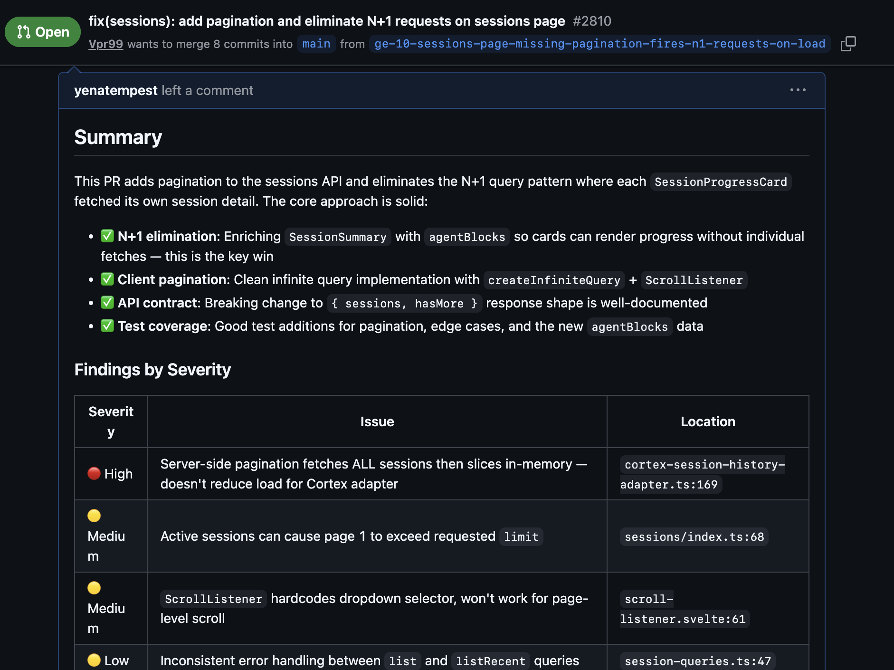
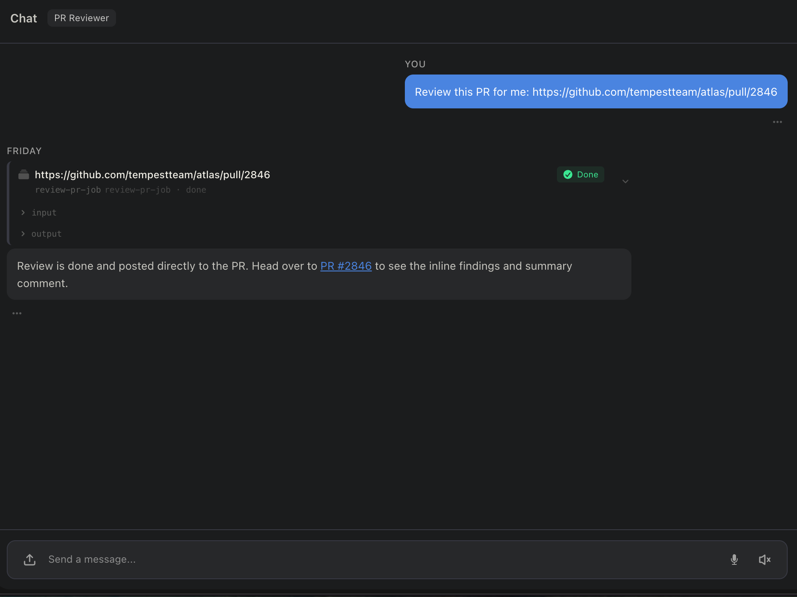

# PR Reviewer

An on-demand pull request review system that runs in your Friday workspace. Paste a GitHub PR URL, and the reviewer fetches the code, analyzes it for bugs, security issues, and style problems, then posts an inline review directly on the PR — no context-switching, no copy-pasting diffs.

---

## What it does

PR Reviewer gives you a thorough senior-level code review posted directly to GitHub. When triggered, it:

- **Reads the PR** — fetches metadata: title, body, author, base/head branches, and changed files
- **Reads each changed file** — pulls the current file contents to understand full context, not just the diff
- **Analyzes the changes** for:
  - Correctness and logic bugs
  - Security issues (injection, auth, secret exposure)
  - Performance concerns
  - Code style and maintainability
  - Missing tests or edge cases
- **Posts an inline GitHub review** — specific comments at the relevant file and line, plus a summary verdict (APPROVE / REQUEST_CHANGES / COMMENT)

---

## What the review looks like

The reviewer posts directly to the GitHub PR as a formal review, with:

- Inline comments on specific lines with explanations and suggestions
- A summary comment with an overall verdict and key findings grouped by severity
- A clear APPROVE, REQUEST_CHANGES, or COMMENT review state

---

## How to use it

Trigger the `review-pr` signal from the Friday UI and paste in the PR URL when prompted.

---

## Setup

### 1. Connect GitHub

GitHub PR Reviewer uses the GitHub MCP server, which needs a personal access token to query your PRs and review requests.

**Generate a token**

1. Go to [github.com/settings/tokens](https://github.com/settings/tokens)
2. Click **Generate new token (classic)**
3. Give it a name (e.g. `friday-digest`)
4. Select the following scopes:
   - `repo` — to read pull requests across your repos
   - `read:user` — to resolve your GitHub username automatically
5. Click **Generate token** and copy it — you won't see it again

**Connect it in Friday**

1. Open the imported workspace and start a chat
2. Friday will detect that GitHub needs credentials and surface a **Connect GitHub** prompt
3. Paste your token when asked
4. You're connected — no further setup needed

### 2. Run your first review

Once GitHub is connected, open the workspace, start a chat, and paste in any PR URL. The reviewer will fetch the code, analyze it, and post the review directly to the PR.

---

## How it works

| Component | Role |
|---|---|
| `pr-reviewer` agent | LLM agent (Claude Opus 4.5) that reads the PR, analyzes changes, and posts the inline review |
| `review-pr-job` job | Single-state FSM that runs the `pr-reviewer` agent with the provided PR URL |
| `review-pr` signal | HTTP signal that accepts a `pr_url` and starts the review job |
| `github` MCP server | Provides PR read, file contents, review write, and comment tools |

The `review-pr` HTTP signal fires the `review-pr-job` FSM, which immediately runs the `pr-reviewer` agent. The agent calls the GitHub MCP tools in sequence: read PR → read files → create pending review → add inline comments → submit.

### GitHub tools used

- `github/pull_request_read` — fetches PR metadata
- `github/list_commits` — lists commits in the PR
- `github/get_file_contents` — reads current file contents
- `github/pull_request_review_write` — creates and submits the review
- `github/add_comment_to_pending_review` — adds inline comments to the pending review
- `github/add_issue_comment` — posts general comments if needed
- `github/search_code` — searches the codebase for context when needed

---

## Notes

- The reviewer uses **Claude Opus 4.5** at temperature 0.3 — thorough and consistent, not creative.
- It reads full file contents, not just the diff, so it can spot issues that only make sense in context.
- Reviews are posted under the GitHub account you connected — make sure that account has write access to the repo.
- The reviewer will not invent findings. If the code looks clean, it says so and approves.
- There is no schedule — every review is triggered manually via the signal or HTTP endpoint.
