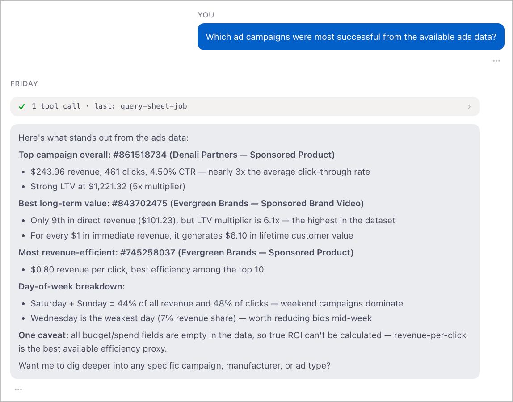
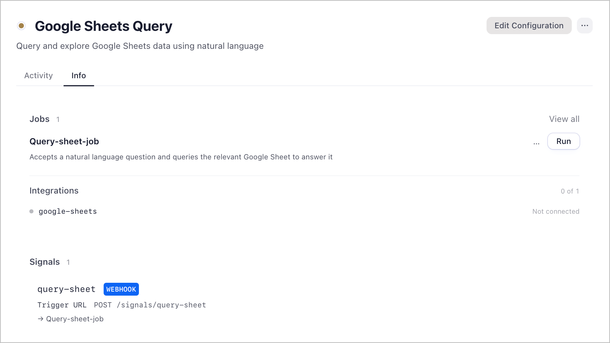

# Google Sheets Query

A natural language interface for your Google Sheets data. Ask questions in plain English and get direct answers — no formula bar to navigate, no pivot tables to build.

Point it at a sheet and ask anything:

- **List spreadsheets** — if you don't specify one, the agent surfaces what's available
- **Explore structure** — reads sheet names, ranges, and layout before answering so it understands what it's working with
- **Read and answer** — pulls the relevant data and responds directly, citing the spreadsheet name, sheet name, and range it used
- **Remember context** — saves key findings to memory so follow-up questions can reference what was already found

---



---

## Setup

### 1. Download Friday

1. Go to [hellofriday.ai](https://hellofriday.ai) and download the macOS installer
2. Open the DMG and drag Friday to your Applications folder
3. Launch Friday and complete the initial setup

### 2. Import the workspace

1. Open Friday and go to **Discover Spaces**
2. Find this workspace and click it
3. Click **Add Space**

### 3. Connect Google Sheets

1. Go to **MCP Catalog → Google Sheets**
2. Under **Credentials**, click **Add one**
3. Follow the OAuth flow to grant access to your Google account

Once connected, the agent can immediately list and read any spreadsheet your Google account has access to.

---

## What a query looks like

> **You:** What were total sales by region last quarter?
>
> **Agent:** Based on the "Q3 Sales" sheet in your "2024 Revenue" spreadsheet (rows 2–847), here's the breakdown by region...

---

## How to use it

Ask questions directly in chat — the `Query sheet job` tool is available in every conversation in this workspace. If you don't specify a spreadsheet, the agent lists what it has access to first.

To trigger it programmatically or from an external system, POST to the `query-sheet` HTTP signal at `/query-sheet` with a JSON body:

```json
{
  "question": "What are the top 5 rows by revenue?",
  "spreadsheet": "My Sales Data"
}
```

`spreadsheet` is optional. If omitted, the agent will list available sheets and pick the most relevant one.

---

## How it works



| Component | Role |
|---|---|
| `sheets-query-agent` | LLM agent (Claude Sonnet) that lists, explores, and reads spreadsheets, then answers the question |
| `query-sheet-job` | Two-state FSM: receive question → run agent → return answer |
| `query-sheet` signal | HTTP signal accepting `question` (required) and `spreadsheet` (optional) at `/query-sheet` |
| `google-sheets` MCP server | Provides `list_spreadsheets`, `get_spreadsheet_info`, `read_sheet_values`, and `list_sheet_tables` tools |

The `query-sheet` signal triggers `query-sheet-job`, which runs `sheets-query-agent`. The agent calls the Google Sheets MCP tools in sequence — list if needed, inspect structure, read data — then returns a direct answer with source attribution.

---

## Notes

- The agent always cites which spreadsheet, sheet, and range it read from so you can verify.
- Key findings are saved to the workspace's `notes` memory, so follow-up questions in the same session can reference earlier results without re-reading the sheet.
- If you ask about a spreadsheet that isn't connected to your Google account, the agent will say so plainly rather than guessing.
- All data stays within your Friday workspace and Google OAuth session. Sheet contents are read only during the agent's turn and are not stored beyond memory notes you explicitly ask it to save.
