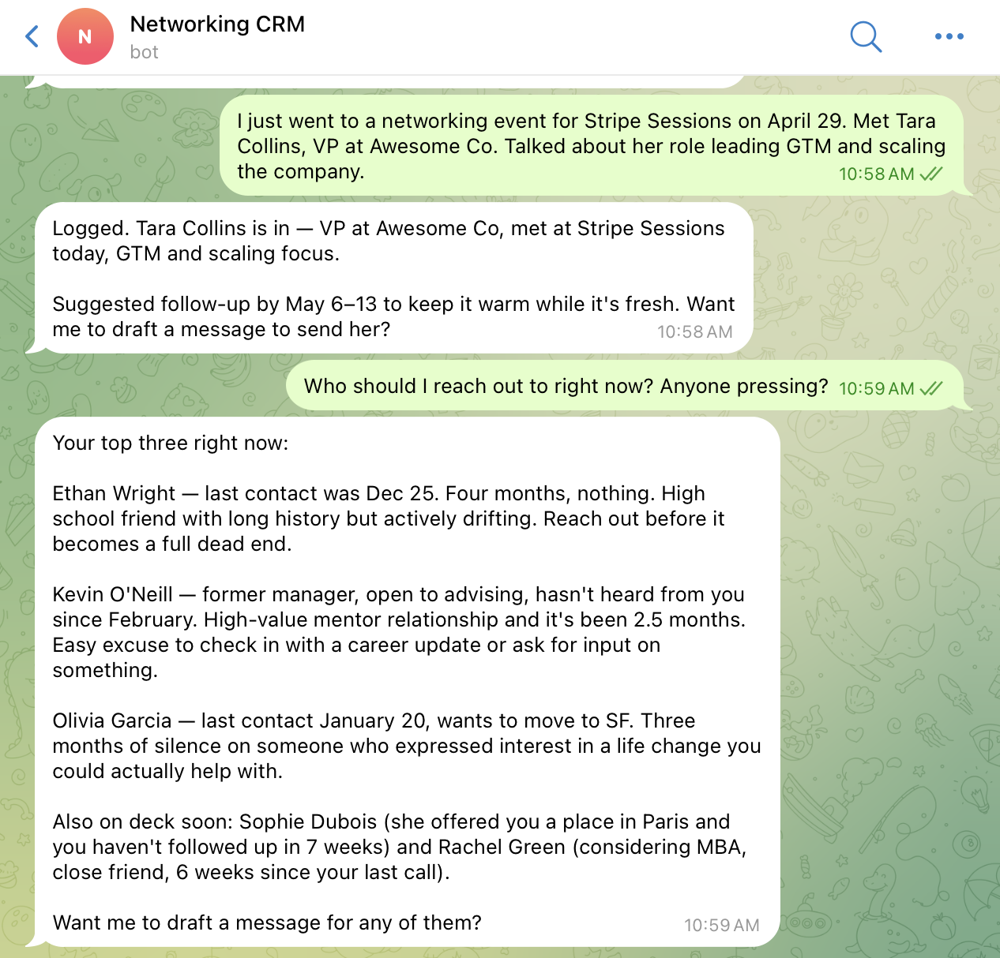
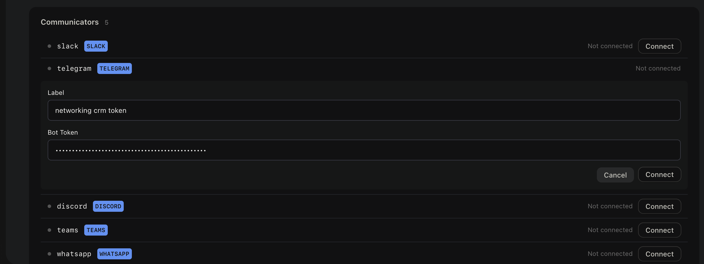
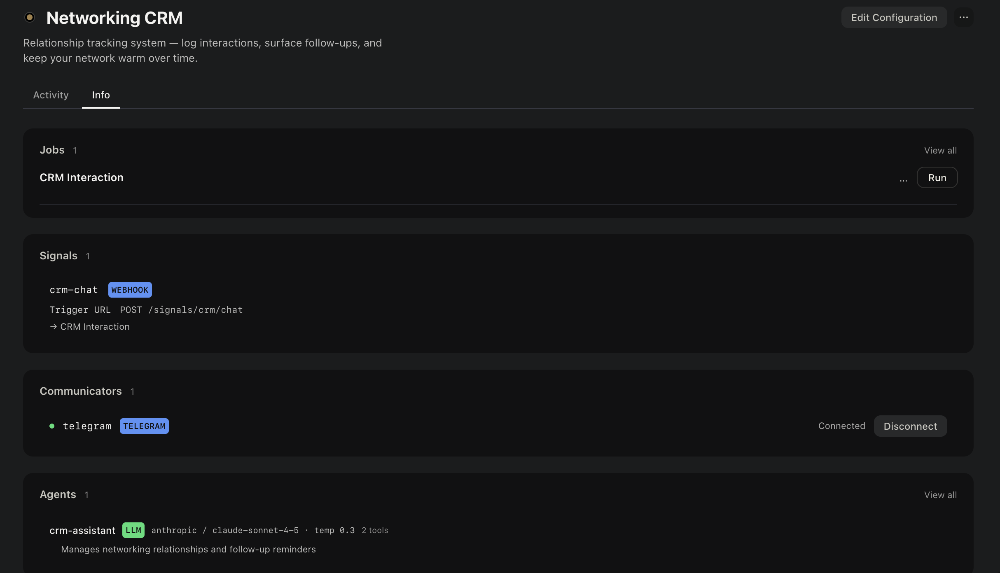

# Networking CRM

A relationship tracking workspace. Send it a message via Telegram to log an interaction, add context about a contact, ask what you know about someone, or find out who you should be following up with — and it keeps your network warm over time.

There's no form to fill in, no spreadsheet to maintain. Just message it the way you'd message a colleague:

- **Log an interaction** — "Had coffee with James today, he's exploring a new role, follow up in two weeks"
- **Add context about a contact** — "Sarah just moved to Head of Product at Stripe"
- **Ask about a contact** — "What do I know about Marcus?" or "When did I last talk to the Acme team?"
- **Surface follow-ups** — "Who should I be following up with this week?" or "Who have I been neglecting?"

The assistant stores everything in a narrative memory — contact name, company/role, date, what happened, commitments made, and next follow-up action. It reads that memory to answer questions and proactively suggests who's due for a touchpoint based on relationship context.

---

## Setup

### Connect the Telegram communicator

1. Go to **Overview > Info > Communicators**
2. Find the Telegram communicator and connect it

Once connected, messages sent to the linked Telegram bot will trigger the CRM assistant automatically.

---

## How to use it

Once set up, message the workspace's Telegram bot. No commands, no syntax — plain English works.

**Examples:**

> "Caught up with Nina yesterday — she's leaving her current role and exploring something new. I said I'd make an intro to the Horizon team."

> "What's the latest with Ben?"

> "Who have I not talked to in a while?"

> "Remind me what I need to follow up on."

The assistant will confirm every save, answer questions directly from what's been logged, and flag contacts that need a nudge. It'll also factor in relationship strength when suggesting timing — a warm lead gets a tighter cycle than a casual connection.

---

## How it works

| Component | Role |
|---|---|
| `crm-assistant` agent | LLM agent (Claude Sonnet) that reads and writes relationship memory |
| `crm-interact` job | FSM job triggered by incoming Telegram messages |
| `notes` memory | Short-term narrative memory where interaction logs are stored |
| `memory` memory | Long-term memory distilled by the system workspace over time |

The Telegram communicator routes incoming messages into the `crm-interact` job. The job invokes the `crm-assistant`, which decides whether to save a new entry, answer a question, or surface follow-ups — then responds back to you in Telegram.

---

## Notes

- All contact data stays in your Friday workspace memory — nothing is sent to external services beyond the LLM call.
- The assistant will not fabricate relationship details. If it doesn't know something, it says so.
- Long-term memory is distilled automatically over time by the system workspace — you don't need to manage it.
