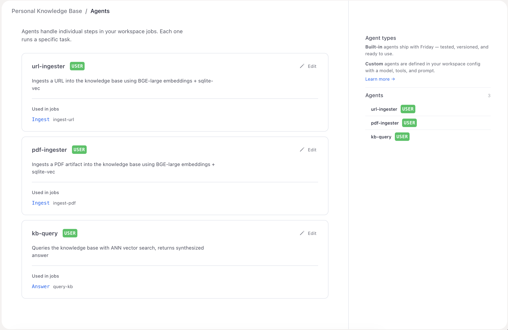

# Personal Knowledge Base

Feed it URLs and PDFs and it indexes them locally with vector embeddings; ask questions and it answers from the indexed material with cited sources. Everything runs on your machine — embeddings, vector search, the database itself — only the answer synthesis call goes to Anthropic.

---



---

## Setup

### 1. Download Friday

1. Go to [hellofriday.ai](https://hellofriday.ai) and download the macOS installer
2. Open the DMG and drag Friday to your Applications folder
3. Launch Friday and complete the initial setup

### 2. Import the workspace

1. Open Friday and go to **Discover Spaces**
2. Find **Personal Knowledge Base** and click it
3. Click **Add Space**

### 3. First-run dependencies

The two Python agents bring their own dependencies via `pyproject.toml`. The first time you trigger ingestion or a query, Friday runs `uv` to:

- Provision a Python 3.12 interpreter under `~/.friday/local/uv/python/`
- Install `sentence-transformers`, `sqlite-vec`, and `pymupdf` into a cached environment
- Download the `BAAI/bge-large-en-v1.5` embedding model (~1.3 GB) from HuggingFace into `~/.cache/huggingface/`

This is one-time per host and takes a couple of minutes. Subsequent runs are fast. No manual `pip` or `venv` step.

> **The model download is ~1.3 GB.** On a slow or flaky connection it can stall. If it does, set `HF_HUB_DISABLE_XET=1` in Friday's environment and retrigger — it switches HuggingFace to the plain HTTP downloader, which is more resilient to interrupted transfers.

### 4. Make sure Python can load SQLite extensions

`sqlite-vec` is a **loadable SQLite extension**, so the agents need a Python whose `sqlite3` module was compiled with extension support. The default macOS system Python and the python.org 3.12 build ship **without** it, and `uv run --python 3.12` may select one of those. When that happens, the agents fail immediately with a clear error:

> This Python lacks SQLite loadable-extension support, which sqlite-vec requires…

The fix is one command — install a uv-managed CPython, which has extension support enabled:

```bash
uv python install 3.12
```

Then retrigger the workspace. `requires-python = ">=3.12"` in each agent's `pyproject.toml` only gates the version, not the build flag, so this can't be caught at install time — the preflight guard catches it at runtime instead.

### 5. That's it

No API keys to configure beyond Anthropic (already set during Friday setup). No external services. The vector DB lives at `~/.friday/local/workspaces/personal-knowledge-base/kb.db`.

---

## How to use it

All three workflows are on-demand HTTP signals. Trigger them from the Friday chat, the Run-now button on the space dashboard, or any external HTTP client.

### Ingest a URL

Hit `/ingest-url` with a single `url` parameter:

| Parameter | Required | Description | Example |
|---|---|---|---|
| `url` | Yes | Page to fetch and index | `"https://example.com/article"` |

The agent fetches the page, strips HTML, chunks the text (~500 chars with 50-char overlap), embeds each chunk, and writes both chunks and vectors to SQLite. Duplicate URLs are skipped.

**Example — in the Friday chat:**

> Trigger ingest-url: url "https://en.wikipedia.org/wiki/Vector_database"

### Ingest a PDF

Drop a PDF into a chat (this uploads it as an artifact), then trigger `/ingest-pdf`:

| Parameter | Required | Description | Example |
|---|---|---|---|
| `artifact_id` | Yes | UUID of the uploaded PDF artifact | `"a1b2c3d4-..."` |
| `source_label` | No | Human-readable name shown in citations | `"Q3 board deck"` |

The agent locates the upload by content hash, extracts text with `pymupdf`, then chunks + embeds + stores like the URL flow.

### Query

Hit `/query-kb` with a question:

| Parameter | Required | Description | Example |
|---|---|---|---|
| `question` | Yes | Natural-language question to answer from the corpus | `"what does the Q3 deck say about churn?"` |

The agent embeds the question with the BGE retrieval prefix, runs an ANN search in `sqlite-vec` for the top 10 chunks, and asks Claude Sonnet to synthesize a grounded answer with `[1]`-style citations and a `sources_consulted` list.

---

## How it works

| Component | Role |
|---|---|
| `ingest-url` / `ingest-pdf` / `query-kb` signals | HTTP triggers at the matching paths |
| `ingest-url` job | Two-state FSM: `idle` → `ingest` |
| `ingest-pdf` job | Two-state FSM: `idle` → `ingest` |
| `query-kb` job | Two-state FSM: `idle` → `answer` |
| `url-ingester`, `pdf-ingester` | Both point at the `kb-ingest-agent` Python agent — same code, different signal payloads |
| `kb-query` | Points at the `kb-query-agent` Python agent |
| `kb-ingest-agent` | Python user agent: chunks content, embeds with BGE, writes to SQLite + `sqlite-vec`. Uses `pymupdf` for PDF text extraction. |
| `kb-query-agent` | Python user agent: embeds the question, runs ANN search via `sqlite-vec` `MATCH` query, hands the top 10 chunks to Claude Sonnet for synthesis. |
| `knowledge-base` long-term memory | Narrative log of every successful ingestion (source, title, doc_id, chunk count) — useful for "what have I ingested?" queries via chat. |

The DB schema is three tables: `documents` (one row per ingested source), `chunk_metadata` (chunk text + foreign key), and `chunk_embeddings` (a `vec0` virtual table holding 1024-dim float vectors). The `kb-query-agent` joins the vector match against `chunk_metadata` and `documents` to surface source titles in the synthesized answer.

---

## Notes

- **Storage paths are configurable.** Set `KB_DB_PATH` in Friday's environment to move the SQLite DB; set `FRIDAY_UPLOADS_ROOT` to point the PDF locator at a non-default `$FRIDAY_HOME/scratch/uploads`.
- **PDF locator strategy.** The ingest agent tries four strategies to read a PDF artifact: contentRef SHA-256 lookup in the uploads tree, generic scan of recent uploads, `parse_artifact` via the SDK, then inline artifact contents. The cascade exists because the Friday daemon's artifact API has historically returned content in several shapes — the agent handles all of them.
- **Embedding model.** `BAAI/bge-large-en-v1.5` produces 1024-dim normalized vectors. The query agent prepends BGE's recommended `"Represent this sentence for searching relevant passages: "` instruction to questions but not to passages — matching the model card.
- **All embedding and search happens locally.** The only external call is Anthropic's API for answer synthesis, and only the top-10 retrieved chunks are sent (no full-document upload).
- **Memory mounts** include read-only access to `user/narrative/notes` and `user/narrative/memory` — your global notes and long-term memory across all workspaces. The agents don't currently use them, but they're available if you extend the prompts to cross-reference your own notes with the knowledge base.
